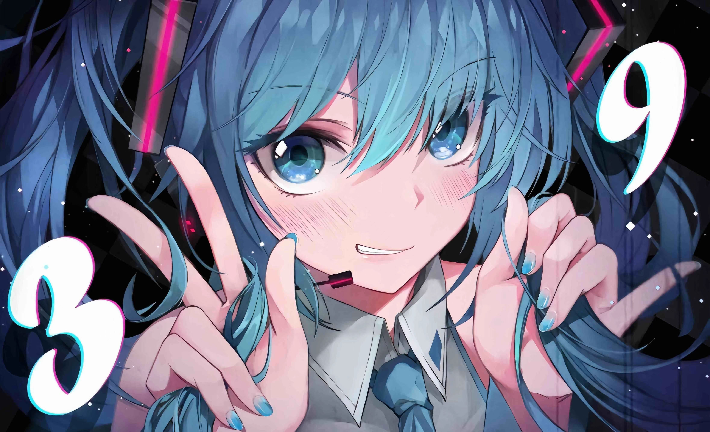

<h2>
   

   
   
   Hey there! I'm AnchialC
   
   
  

</h2>

<!-- ## 👋 &nbsp;Hey there! I'm AnC -->

### 👨🏻‍💻 &nbsp;About Me

💡 &nbsp;I like to explore new technologies and develop software solutions and quick hacks.\
🎓 &nbsp;I'm currently studying Computer Science and Digital Technology.\
🌱 &nbsp;I'm always looking to improve my skills and learn new things.\
✍️ &nbsp;In my free time, I like to write blogs and articles about my experiences and learnings.\
💬 &nbsp;I'm always open to new opportunities and collaborations.\
✉️ &nbsp;You can shoot me an email at yusuaois@outlook.com! I'll try to respond as soon as I can.\

### 🛠 &nbsp;Tech Stack

&nbsp;
&nbsp;
&nbsp;
&nbsp;
&nbsp;
&nbsp;
&nbsp;
&nbsp;
\
&nbsp;
&nbsp;
&nbsp;
&nbsp;
&nbsp;
&nbsp;
\
&nbsp;
&nbsp;
&nbsp;
&nbsp;
\
&nbsp;
&nbsp;
&nbsp;
\
&nbsp;
&nbsp;

<!--  -->

## ⚙️ &nbsp;GitHub Analytics

### 🤝🏻 &nbsp;Connect with Me

### 📖 &nbsp;Visitors

[github-sub-title:img]: https://readme-typing-svg.herokuapp.com?font=Segoe+Script&center=true&lines=AnchialC.
